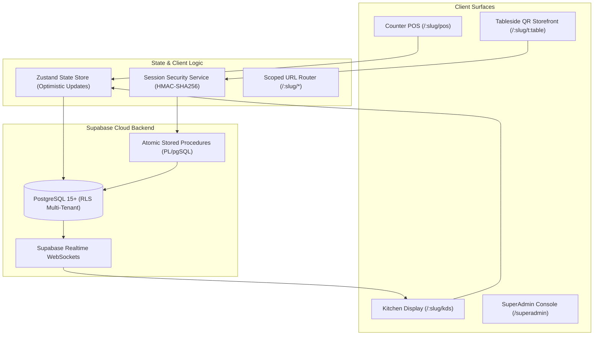
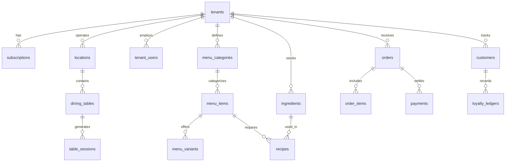

# TSOS Technical Documentation & Architecture Specification

- **System**: TSOS (The Cafe Operating System)
- **Version**: 5.0.0 (production rebuild, ADR-0014)
- **Architect**: Lead Full-Stack Security & Platform Architect
- **Updated**: October 1, 2026

---

## 1. System Overview & Architecture

TSOS is a cloud-native, multi-tenant B2B SaaS platform engineered specifically for cafes, specialty coffee roasters, bakeries, and quick-service restaurants (QSRs). It provides a unified system spanning counter POS, kitchen display (KDS), inventory recipe depletion, shifts reconciliation, and guest tableside self-ordering.




---

## 2.0 — v5.0.0 Production Rebuild (ADR-0014) — CURRENT ARCHITECTURE

**Mandate**: the application equals the owner's Figma (ServePoint). One theme, one data source, zero demo content.

### 2.0.1 Module map (complete)
- `src/App.tsx` — role router: no session → AuthScreen; `superadmin` → `PlatformScreen` (always); `owner|staff` → `AppShell` section router (dashboard/food/messages/bills/notifications/support/settings).
- `src/components/shell/` — `Sidebar` (deep-teal rail, gold pills, user card; 76px icon rail < md), `Header` (back + breadcrumbs, bell w/ gold dot, history clock, search), `AppShell` (shell + Open Profile modal).
- `src/lib/api.ts` — the ONLY data access: typed Supabase CRUD (categories, menu_items, orders+items, notifications, conversations/messages, tenants, subscriptions, audit logs, dashboard aggregation, provisionBusiness). No mocks/seed fallbacks; errors throw → screens render honest error cards with Retry.
- `src/lib/tenant.ts` — `useTenant()`: session.tenant_id → direct; else slug lookup; else honest unlinked-workspace state.
- `src/lib/authService.ts` — Supabase Auth primary + local credential registry (`servepoint_local_credentials`) for wizard/owner-created accounts; bootstrap operator `admin@tsos.dev` pinned to `superadmin`; sign-in = email+password only.
- `src/lib/prefs.ts` — persisted production settings (currency ₹ default, payment methods, notification toggles, compact density, timezone) consumed by Bills (charge methods) and Settings.
- `src/store/session.ts` (session + section/breadcrumb/search/profile UI), `src/store/cart.ts` (order builder: lines, order type, table/guests/customer, GST math helpers).
- Screens: `dashboard/` (Recharts per Dashboard frames), `food/` (categories→items→Frame_30 modal→order drawer→createOrder), `bills/` (two-pane, legacy-status normalization, charge flow), `messages/` + `notifications/` (migration-004 aware), `support/`, `settings/` (7 sections; Staff accounts owner-only), `platform/` (PlatformScreen + ProvisioningWizard).

### 2.0.2 Deleted (recoverable in git history ≤ v4.0.0)
KDS, Inventory (+Restock), Menu management, Shifts (+Drawer Reconciliation), Customers, Offers, Reports (+LiveOpsPulse/Heatmap/Weekly), Tables, Orders two-pane (replaced by Bills), POS/CartDrawer/PaymentModal/Receipt/Variant (replaced by Food & Drinks flow), Storefront/OrderTracking (QR guest journey), native clients, printer/session/sound/realtime services, `src/data/*` seeds, 1,865-line hybrid store, Tessera/dark themes + remap layer, dev tools, alias auto-login.

### 2.0.3 Database state
Migrations 001/002/003 shipped; **004** (`004_notifications_messages.sql`) adds notifications/conversations/conversation_messages + member RLS + default team conversations. Owner must run 001+003+004 in the Supabase SQL editor (RLS 42501 on orders INSERT and tenants INSERT persists until then; the app surfaces it honestly).

---

## 2. Frontend Architecture

### 2.1 Technology Stack
- **Framework**: React 19 with TypeScript 7.0.
- **Build Tool**: Vite 8.3 (ESM-native fast HMR and optimized production bundling).
- **Styling**: Tailwind CSS 4.3 with custom design tokens for Warm Cafe Cream and Obsidian Dark Terminal.
- **Icons**: Lucide React.
- **State Management**: Zustand 5 with `persist` middleware for zero-latency local caching.

### 2.2 Component Hierarchy & Surfaces
- `src/App.tsx`: Root router parsing path-based tenant slugs and rendering active surface components.
- `src/components/layout/Header.tsx`: Global system bar featuring tenant identity, offline/online sync status pill, shift indicator, and the **single-button Obsidian Mode toggle**.
- `src/components/layout/NavigationSidebar.tsx`: Surface switcher for authenticated staff (POS, KDS, Orders, Inventory, Reports, Settings).
- `src/components/pos/PosScreen.tsx`: High-velocity cash register with category tabs, dish search, customizable modifiers modal (`VariantModal`), dine-in table selector, and cart drawer.
- `src/components/kds/KdsScreen.tsx`: Kitchen display pipeline showing active tickets grouped by stage (`new`, `preparing`, `ready`, `completed`) with SLA progress timers.
- `src/components/storefront/StorefrontScreen.tsx`: Guest mobile self-ordering surface with live 10-minute session countdown, warning banners, security auto-lock modal, and UPI payment integration.

---

## 3. Dynamic Scoped Path-Based Routing Engine

The routing layer extracts tenant slugs dynamically from the window location pathname:

| Route Pattern | Target Component | Access Role | Description |
|---|---|---|---|
| `/:slug/pos` | `PosScreen` | Cashier, Manager, Owner | Scoped point of sale billing terminal. |
| `/:slug/kds` | `KdsScreen` | Kitchen Staff, Barista | Real-time kitchen display board. |
| `/:slug/orders` | `OrdersScreen` | Cashier, Manager | Master order directory with status filtering & receipt reprinting. |
| `/:slug/inventory` | `InventoryScreen` | Manager, Owner | Ingredient stock ledger and recipe consumption costs. |
| `/:slug/reports` | `ReportsScreen` | Manager, Owner | Sales telemetry, payment modes, order-type analytics, and tax reporting. |
| `/:slug/settings` | `SettingsScreen` | Owner, Manager | Outlet profile, thermal printers, and tax configuration. |
| `/:slug/t:tableNumber?token=:token` | `StorefrontScreen` | Anonymous Diner | Guest self-ordering with 10-minute ephemeral session validation. |
| `/superadmin` | `SuperAdminScreen` | Platform SuperAdmin | Tenant provisioning, SaaS telemetry, and workspace impersonation. |

---

## 4. Supabase Database Schema & Multi-Tenancy

The database is deployed on PostgreSQL 15 with `pgcrypto` enabled. All operational tables maintain a strict `tenant_id UUID REFERENCES tenants(id) ON DELETE CASCADE`.

### 4.1 Schema Overview



### 4.2 Row-Level Security (RLS) Architecture
PostgreSQL RLS ensures that queries from one cafe never leak or touch another cafe's records:

```sql
-- Helper function to extract tenant ID from JWT claims
CREATE OR REPLACE FUNCTION current_tenant_id()
RETURNS UUID
LANGUAGE sql
STABLE
AS $$
  SELECT NULLIF(current_setting('request.jwt.claims', true)::json->>'tenant_id', '')::uuid;
$$;

-- Global RLS enforcement
ALTER TABLE orders ENABLE ROW LEVEL SECURITY;

CREATE POLICY "Tenant Staff Full Isolation"
ON orders FOR ALL
TO authenticated
USING (tenant_id = current_tenant_id())
WITH CHECK (tenant_id = current_tenant_id());
```

---

## 5. Ephemeral Table QR Session Security Architecture

### 5.1 Threat Vector
Diners who scan a static table QR URL (`/coolkafe/t4?token=sec_xyz`) have that URL saved in mobile browser history and bookmarks. When reopening mobile tabs days later, accidental taps trigger orders at the restaurant table from home.

### 5.2 Cryptographic Solution
1. **Physical Secret**: Printed on table stickers (`dining_tables.qr_token`).
2. **Short-Lived Token**: Server validates physical secret and issues an HMAC-SHA256 session token valid for exactly **10 minutes** (`expires_at = now() + INTERVAL '10 minutes'`).
3. **Session Store (`table_sessions`)**:
   - `id`: UUID primary key.
   - `tenant_id`: Foreign key to `tenants`.
   - `table_id`: Foreign key to `dining_tables`.
   - `session_token`: Cryptographically secure unique token string.
   - `token_hash`: SHA256 HMAC digest.
   - `status`: `'active' | 'expired' | 'revoked' | 'consumed'`.
   - `expires_at`: Expiration timestamp.
4. **Order Submission Guard**: All orders submitted via `POST /api/orders` require header:
   ```
   X-Table-Session-Token: <token>
   ```
   The backend invokes `verify_and_consume_table_session(p_session_token, p_table_id)` which:
   - Validates the token exists and is in `'active'` status.
   - Verifies `session.table_id == order.table_id` (rejects table spoofing with `TABLE_MISMATCH`).
   - Checks `expires_at >= now()` (rejects expired sessions with `SESSION_EXPIRED`).
   - Checks table status in `dining_tables` (rejects settled tables with `TABLE_SETTLED`).
5. **Auto-Lock Screen**: Storefront UI countdown timer (`mm:ss`) displays remaining time. At $\le$ 2 minutes, an amber warning banner appears. At 00:00, the screen locks with a backdrop overlay prompting the diner to scan the physical QR code sticker to renew.

---

## 6. Industrial Obsidian Mode Design System

TSOS features a global, single-button **Obsidian Mode** theme designed for high-contrast visibility and glare reduction.

### 6.1 Theme Token Specifications

| Token Category | Warm Cafe Mode (Default) | Obsidian Terminal Mode |
|---|---|---|
| **App Canvas Background** | `#FFF9F2` (Cream Stone-50) | `#0C0A09` (Deep Pitch Stone-950) |
| **Card & Panel Surfaces** | `#FFFFFF` (Pure White) | `#1C1917` (Industrial Stone-900) |
| **Grid Lines & Borders** | `#E9E0D6` (Warm Sand) | `#292524` (Hairline Stone-800) |
| **Primary Typography** | `#1C1917` (Deep Espresso) | `#F5F5F4` (Crisp Chalk White) |
| **Numeric Monospace Text** | `font-mono` Deep Stone | `font-mono text-[#F59E0B]` (Phosphor Amber) |
| **Status Accents** | Warm Orange (`#F97316`) | Emerald (`#10B981`) & Amber (`#F59E0B`) |

### 6.2 Implementation
Managed centrally in `src/lib/store.ts` via `isObsidianMode` state and toggled via the global header button with `toggleObsidianMode()`. State is automatically persisted in `localStorage`.

---

## 6.5 Tessera Theme (v2.6.0 — Editorial Dark / Forest + Chartreuse)

Tessera is the **default theme** as of v2.6.0, inspired by [uiverse.io/ui-kits/tessera](https://uiverse.io/ui-kits/tessera). It is an editorial dark design system pairing italic serif headlines with crisp sans body, deep forest surfaces, and a vivid chartreuse action accent. Signature 3D isometric block motifs add volume and rhythm.

### 6.5.0 Design Governance (v2.6.5 — ADR-0010)
- **Login screen (ADR-0010 → v4.0.0)**: the owner's original freeze was LIFTED by explicit owner order in v4.0.0 — the screen is now a single email+password form (no Register Cafe, no Magic Link, no one-click logins, no on-screen credentials). Accounts are provisioned: the SuperAdmin wizard creates owners; owners create staff logins (Settings → Staff Accounts). All credentials live in `docs/CREDENTIALS.md`.
- **v4.0.0 role model**: `UserRole = 'superadmin' | 'owner' | 'staff'` (`normalizeRole()` in `lib/rbac.ts` folds all legacy roles → `staff`). Superadmin sessions ALWAYS land on the SuperAdmin Platform (App.tsx checkSession + handleUrlRoute guard) — the "superadmin gets POS screen" bug is fixed. Owner = dashboards + everything + `canManageStaff`; staff = the whole POS app without account creation. Provisioned accounts persist in the `tsos_local_credentials` localStorage registry (offline-first) + Supabase Auth (best-effort). DB: `supabase/migrations/003_role_model_staff_merge.sql` (owner must run in the SQL editor).
.