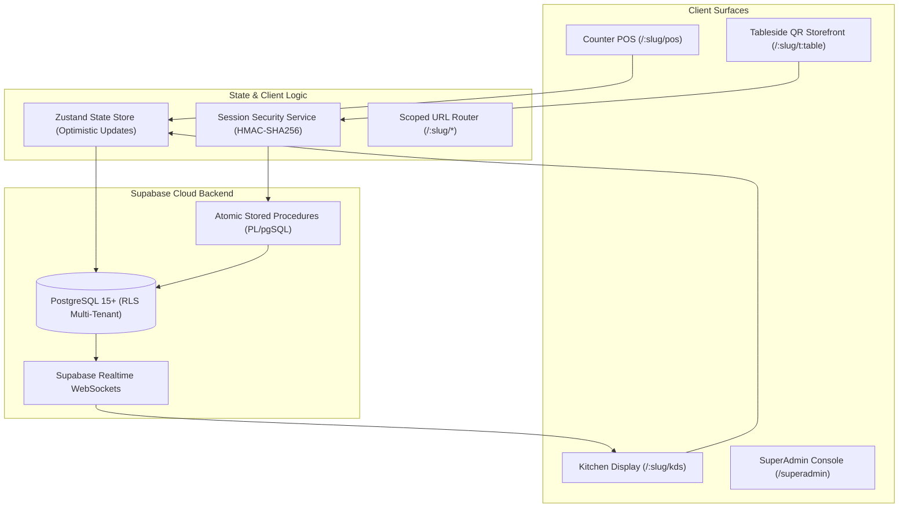
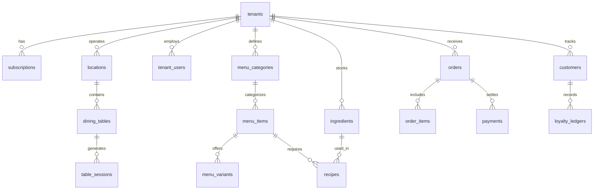

# TSOS Technical Documentation & Architecture Specification

- **System**: TSOS (The Cafe Operating System)
- **Version**: 2.6.7
- **Architect**: Lead Full-Stack Security & Platform Architect
- **Updated**: October 1, 2026

---

## 1. System Overview & Architecture

TSOS is a cloud-native, multi-tenant B2B SaaS platform engineered specifically for cafes, specialty coffee roasters, bakeries, and quick-service restaurants (QSRs). It provides a unified system spanning counter POS, kitchen display (KDS), inventory recipe depletion, shifts reconciliation, and guest tableside self-ordering.



---

## 2. Frontend Architecture

### 2.1 Technology Stack
- **Framework**: React 19 with TypeScript 7.0.
- **Build Tool**: Vite 8.3 (ESM-native fast HMR and optimized production bundling).
- **Styling**: Tailwind CSS 4.3 with custom design tokens for Warm Cafe Cream and Obsidian Dark Terminal.
- **Icons**: Lucide React.
- **State Management**: Zustand 5 with `persist` middleware for zero-latency local caching.

### 2.2 Component Hierarchy & Surfaces
- `src/App.tsx`: Root router parsing path-based tenant slugs and rendering active surface components.
- `src/components/layout/Header.tsx`: Global system bar featuring tenant identity, offline/online sync status pill, shift indicator, and the **single-button Obsidian Mode toggle**.
- `src/components/layout/NavigationSidebar.tsx`: Surface switcher for authenticated staff (POS, KDS, Orders, Inventory, Reports, Settings).
- `src/components/pos/PosScreen.tsx`: High-velocity cash register with category tabs, dish search, customizable modifiers modal (`VariantModal`), dine-in table selector, and cart drawer.
- `src/components/kds/KdsScreen.tsx`: Kitchen display pipeline showing active tickets grouped by stage (`new`, `preparing`, `ready`, `completed`) with SLA progress timers.
- `src/components/storefront/StorefrontScreen.tsx`: Guest mobile self-ordering surface with live 10-minute session countdown, warning banners, security auto-lock modal, and UPI payment integration.

---

## 3. Dynamic Scoped Path-Based Routing Engine

The routing layer extracts tenant slugs dynamically from the window location pathname:

| Route Pattern | Target Component | Access Role | Description |
|---|---|---|---|
| `/:slug/pos` | `PosScreen` | Cashier, Manager, Owner | Scoped point of sale billing terminal. |
| `/:slug/kds` | `KdsScreen` | Kitchen Staff, Barista | Real-time kitchen display board. |
| `/:slug/orders` | `OrdersScreen` | Cashier, Manager | Master order directory with status filtering & receipt reprinting. |
| `/:slug/inventory` | `InventoryScreen` | Manager, Owner | Ingredient stock ledger and recipe consumption costs. |
| `/:slug/reports` | `ReportsScreen` | Manager, Owner | Sales telemetry, payment modes, order-type analytics, and tax reporting. |
| `/:slug/settings` | `SettingsScreen` | Owner, Manager | Outlet profile, thermal printers, and tax configuration. |
| `/:slug/t:tableNumber?token=:token` | `StorefrontScreen` | Anonymous Diner | Guest self-ordering with 10-minute ephemeral session validation. |
| `/superadmin` | `SuperAdminScreen` | Platform SuperAdmin | Tenant provisioning, SaaS telemetry, and workspace impersonation. |

---

## 4. Supabase Database Schema & Multi-Tenancy

The database is deployed on PostgreSQL 15 with `pgcrypto` enabled. All operational tables maintain a strict `tenant_id UUID REFERENCES tenants(id) ON DELETE CASCADE`.

### 4.1 Schema Overview



### 4.2 Row-Level Security (RLS) Architecture
PostgreSQL RLS ensures that queries from one cafe never leak or touch another cafe's records:

```sql
-- Helper function to extract tenant ID from JWT claims
CREATE OR REPLACE FUNCTION current_tenant_id()
RETURNS UUID
LANGUAGE sql
STABLE
AS $$
  SELECT NULLIF(current_setting('request.jwt.claims', true)::json->>'tenant_id', '')::uuid;
$$;

-- Global RLS enforcement
ALTER TABLE orders ENABLE ROW LEVEL SECURITY;

CREATE POLICY "Tenant Staff Full Isolation"
ON orders FOR ALL
TO authenticated
USING (tenant_id = current_tenant_id())
WITH CHECK (tenant_id = current_tenant_id());
```

---

## 5. Ephemeral Table QR Session Security Architecture

### 5.1 Threat Vector
Diners who scan a static table QR URL (`/coolkafe/t4?token=sec_xyz`) have that URL saved in mobile browser history and bookmarks. When reopening mobile tabs days later, accidental taps trigger orders at the restaurant table from home.

### 5.2 Cryptographic Solution
1. **Physical Secret**: Printed on table stickers (`dining_tables.qr_token`).
2. **Short-Lived Token**: Server validates physical secret and issues an HMAC-SHA256 session token valid for exactly **10 minutes** (`expires_at = now() + INTERVAL '10 minutes'`).
3. **Session Store (`table_sessions`)**:
   - `id`: UUID primary key.
   - `tenant_id`: Foreign key to `tenants`.
   - `table_id`: Foreign key to `dining_tables`.
   - `session_token`: Cryptographically secure unique token string.
   - `token_hash`: SHA256 HMAC digest.
   - `status`: `'active' | 'expired' | 'revoked' | 'consumed'`.
   - `expires_at`: Expiration timestamp.
4. **Order Submission Guard**: All orders submitted via `POST /api/orders` require header:
   ```
   X-Table-Session-Token: <token>
   ```
   The backend invokes `verify_and_consume_table_session(p_session_token, p_table_id)` which:
   - Validates the token exists and is in `'active'` status.
   - Verifies `session.table_id == order.table_id` (rejects table spoofing with `TABLE_MISMATCH`).
   - Checks `expires_at >= now()` (rejects expired sessions with `SESSION_EXPIRED`).
   - Checks table status in `dining_tables` (rejects settled tables with `TABLE_SETTLED`).
5. **Auto-Lock Screen**: Storefront UI countdown timer (`mm:ss`) displays remaining time. At $\le$ 2 minutes, an amber warning banner appears. At 00:00, the screen locks with a backdrop overlay prompting the diner to scan the physical QR code sticker to renew.

---

## 6. Industrial Obsidian Mode Design System

TSOS features a global, single-button **Obsidian Mode** theme designed for high-contrast visibility and glare reduction.

### 6.1 Theme Token Specifications

| Token Category | Warm Cafe Mode (Default) | Obsidian Terminal Mode |
|---|---|---|
| **App Canvas Background** | `#FFF9F2` (Cream Stone-50) | `#0C0A09` (Deep Pitch Stone-950) |
| **Card & Panel Surfaces** | `#FFFFFF` (Pure White) | `#1C1917` (Industrial Stone-900) |
| **Grid Lines & Borders** | `#E9E0D6` (Warm Sand) | `#292524` (Hairline Stone-800) |
| **Primary Typography** | `#1C1917` (Deep Espresso) | `#F5F5F4` (Crisp Chalk White) |
| **Numeric Monospace Text** | `font-mono` Deep Stone | `font-mono text-[#F59E0B]` (Phosphor Amber) |
| **Status Accents** | Warm Orange (`#F97316`) | Emerald (`#10B981`) & Amber (`#F59E0B`) |

### 6.2 Implementation
Managed centrally in `src/lib/store.ts` via `isObsidianMode` state and toggled via the global header button with `toggleObsidianMode()`. State is automatically persisted in `localStorage`.

---

## 6.5 Tessera Theme (v2.6.0 — Editorial Dark / Forest + Chartreuse)

Tessera is the **default theme** as of v2.6.0, inspired by [uiverse.io/ui-kits/tessera](https://uiverse.io/ui-kits/tessera). It is an editorial dark design system pairing italic serif headlines with crisp sans body, deep forest surfaces, and a vivid chartreuse action accent. Signature 3D isometric block motifs add volume and rhythm.

### 6.5.0 Design Governance (v2.6.5 — ADR-0010)
- **Login screen FROZEN**: `src/components/auth/AuthScreen.tsx` is owner-approved as-is at v2.6.4 (commit `5f38efc`). No visual/structural/copy changes until an explicit owner unfreeze — automated redesign passes must skip this file (forced crash-fixes must be visual-neutral and logged in the worklog).
- **Designated future login artwork**: *Free 75 Illustrations — Surface Pack* (Figma Community). Wiring plan (left brand panel, Tessera-tinted decorative layer) documented in [ADR-0010](docs/decisions/0010-login-screen-design-freeze-and-design-system-directives.md); the sandbox is CloudFront-blocked from figma.com (HTTP 403, verified 2026-10-01), so assets arrive via owner export into `src/assets/illustrations/`.
- **Post-login component reference**: *shadcn/ui Design System* (Figma Community) — dark/light mode, buttons, forms. TSOS already implements the shadcn CSS-variable token architecture; Tessera rides on it as the default dark skin. Explicit-Tessera surfaces completed: Header, WebNavbar, POS menu + cart, KDS, Payment/Variant modals, **OrdersScreen (v2.6.5)**; remaining: SuperAdmin, Storefront/OrderTracking, Customers, Inventory, Menu, Tables, Offers, Shifts, Settings, PrintLogsSection.

### 6.6 ServePoint Theme (v2.6.6 — Owner Figma, ADR-0011; exact tokens since v2.6.7, ADR-0012)
- **Source**: owner's ServePoint POS Preview Figma. **Since v2.6.7 the design source is unlocked and archived in-repo** (ADR-0012): owner-provided `FIGMA_TOKEN` (stored in `.env` + `render.yaml`) opened the REST API — all 6 pages explored, **all 57 "04 Final UI" frames rendered to PNG** at `docs/design/servepoint/frames/` + 6 page overviews at `docs/design/servepoint/pages/`. The v2.6.6 cover-thumbnail estimates are superseded by node-fill mining of "04 Final UI" + "05 Components".
- **EXACT tokens (v2.6.7)**: ivory canvas `#F6F5F2` · signature **sage surface `#D9E2DD`** (cards, search inputs, sidebar user card) · white detail cards `#FFFFFF` + soft teal shadow `0 10px 30px -14px rgba(15,61,62,0.14)` · **deep-teal primary `#0F3D3E`** (sidebar, dark CTAs) · **gold accent `#B88E2F`, pressed `#967221`** (Primary Button variants) · text `#1A1A1A` / `#6B6B6B` / `#969696` · danger `#DC2626` · hairline `#E3E7E0` · radii 12 buttons/inputs · 16 cards · 24 large · 100 pills.
- **Typography**: **Poppins** — 400/16 body, 500/16 buttons/labels, 600/24 headings, 500/20 sub-heads, 400/12 captions (mined from TEXT styles); imported in `index.html`.
- **Activation**: `[data-theme="servepoint"]` token + remap layer in `src/index.css` (creams→ivory, stone→near-black text, orange→gold accent, dark-stone strips→deep teal `#0F3D3E`, inset surfaces→sage `#D9E2DD`). Default ThemeMode for the authenticated app; stored `tessera` one-time-migrates. Toggle cycles `servepoint → tessera → dark`.
- **Auth-scoped pinning**: `App.tsx` sets `data-theme="tessera"` whenever `!authSession || isAuthLoading` (frozen login ADR-0010 + public storefront keep their approved Tessera environment; zero AuthScreen edits). ServePoint tokens apply only to the authenticated document.
- **Utilities**: `.sp-cta` (EXACT Primary Button: gold `#B88E2F`, near-black text, Poppins 500, r12, hover `#967221`), `.sp-sidebar` (deep-teal `#0F3D3E` panel), `.sp-banner` (gold gradient category hero), `.sp-ghost` (white button, gold hover ring), `.sp-surface` (sage surface, new v2.6.7).
- **Explicit surfaces so far**: Header (gold brand block, sp-cta Fast PIN), WebNavbar (gold active tab + baseline marker, soft-shadow dropdown, sage dropdown hover), **PosScreen menu cards (v2.6.7 — sage card, gold Add CTA, near-black text, `#C9D3CC` divider, `#DC2626` low-stock badge)**. Remaining surfaces approximate ServePoint via the remap layer until their explicit pass (roadmap in ADR-0011).

### 6.5.1 Theme Token Specifications

| Token Category | Warm Cafe (legacy default) | Tessera (new default) |
|---|---|---|
| **App Canvas Background** | `#FFF9F2` (Cream Stone-50) | `#0A1410` (Deep Forest) |
| **Card & Panel Surfaces** | `#FFFFFF` (Pure White) | `#0F1D17` (Forest Surface) |
| **Inset / Secondary Surfaces** | `#F5F0EB` (Warm Sand) | `#142620` (Forest Surface-2) |
| **Grid Lines & Borders** | `#E9E0D6` (Warm Sand) | `#1F3D2E` (Moss Hairline) / `#2A4A37` (Moss Strong) |
| **Primary Typography** | `#1C1917` (Deep Espresso) | `#F5F4EE` (Warm Off-White) |
| **Secondary Text** | `#57534E` (Stone-600) | `#9BB5A5` (Sage) |
| **Muted / Caption** | `#A8A29E` (Stone-400) | `#6B8579` (Moss) |
| **Action Accent** | `#F97316` (Warm Orange) | `#C5F82A` (Vivid Chartreuse) |
| **Status: Completed** | `#17803D` (Emerald-700) | `#34D399` (Emerald-400, tuned for forest) |
| **Status: Attention** | `#B45309` (Amber-700) | `#FBBF24` (Amber-400) |
| **Status: Destructive** | `#B42318` (Red-700) | `#F87171` (Red-400) |
| **Status: Info** | `#2563EB` (Blue-700) | `#60A5FA` (Blue-400) |
| **Headline Font** | `Plus Jakarta Sans` (sans, weight 800) | `Instrument Serif` italic (weight 400) |
| **Body Font** | `Inter` | `Inter` (unchanged) |

### 6.5.2 Typography Pairing (the Tessera signature)
- **h1, h2, h3, .font-display**: `Instrument Serif` italic — gives the editorial feel.
- **h4**: `Inter` sans, uppercase, tracked `0.08em` — sub-section labels contrast against the serif headlines.
- **body, labels, captions**: `Inter` (300–800 weights available).
- **numeric/tabular**: `JetBrains Mono` for receipts, KPIs, timestamps.

### 6.5.3 3D Isometric Block-Motif Utilities
The "block motif" is the Tessera signature for volume and rhythm — hard offset shadows that make cards feel raised:
- `.tessera-block` — `box-shadow: 3px 3px 0 #1F3D2E, 3px 3px 0 4px rgba(0,0,0,0.4)`. Used on hero cards (LiveOpsPulse, OrderTypeBreakdown, KPI cards, AuthScreen card).
- `.tessera-block-chartreuse` — `box-shadow: 3px 3px 0 #C5F82A, 3px 3px 0 4px rgba(0,0,0,0.4)`. Used on chartreuse-tinted accent cards (e.g. "Savings with TSOS" KPI).
- `.tessera-cta` — chartreuse `#C5F82A` button with forest `#0A1410` text, `translateY(-1px)` hover lift + 3D shadow, `translateY(1px)` active press.
- `.tessera-ghost` — transparent forest button with moss border, chartreuse hover border + chartreuse hover text.
- `.tessera-grain` — subtle CSS-only radial-gradient grain texture (chartreuse + emerald tints) applied to the app canvas wrapper.

### 6.5.4 Implementation
The Tessera theme is implemented as a CSS variable override layer in `src/index.css` under the `[data-theme="tessera"]` / `.tessera` selectors. It maps every warm-cream hex color used in Tailwind utility classes (e.g. `bg-[#FFF9F2]`, `text-[#1C1917]`, `border-[#E9E0D6]`) to the forest equivalent — so the entire existing component tree (POS, KDS, Orders, Inventory, etc.) inherits the Tessera palette automatically without per-component edits. The headline font-family override (`Instrument Serif` italic for h1-h3) is applied globally under the same selector.

Theme state is managed in `src/lib/store.ts`:
- `themeMode: ThemeMode` — `'tessera'` (default) | `'warm'` | `'dark'` | `'obsidian'`. Persisted in `localStorage` under `tsos_theme_mode`.
- `setThemeMode(mode)` — sets the `data-theme` attribute on `<html>`, adds/removes the `tessera` / `dark` / `obsidian` classes.
- `toggleThemeMode()` — cycles `tessera ↔ dark` (keeps the editorial dark language; `warm` is reachable via explicit `setThemeMode('warm')`).

### 6.5.5 Explicit Surface Polish & KDS Terminal Remap (v2.6.1)
Two complementary strategies are used to bring surfaces to full Tessera fidelity:

1. **Explicit conditional classes** — components read `themeMode` from the store and compute `const isTessera = themeMode === 'tessera'`, then branch their Tailwind class strings. This preserves the warm/dark/obsidian palettes byte-for-byte while adding Tessera-only flourishes: `tessera-block` 3D offset shadows, `tessera-cta` primary actions, `tessera-ghost` secondary buttons, chartreuse baseline markers under active nav tabs, solid chartreuse category pills with `shadow-[2px_2px_0_#1F3D2E]`, soft-tinted status badges (15% fill / 40% border), serif italic tenant/user names, and the Tessera status palette for role avatars (`#C084FC`/`#C5F82A`/`#60A5FA`/`#34D399`). Applied to: `Header.tsx`, `WebNavbar.tsx`, `PosScreen.tsx`, `CartDrawer.tsx`, `KdsScreen.tsx` (header flourishes only).

2. **CSS hex remap extension** (`src/index.css` §11) — the KDS board is an always-dark terminal built on zinc hexes (`#18181B`, `#121110`, `#0C0A09`, `#27272A`, `#FAFAFA`, `#A1A1AA`, `#71717A`, `#3F3F46`, `text-zinc-400/500`). Under `[data-theme="tessera"]` these remap to the forest palette (`#0F1D17` / `#0A1410` / `#142620` / `#F5F4EE` / `#9BB5A5` / `#6B8579` / `#2A4A37`), converting the entire board without touching its component code. The same section fixes a v2.6.0 defect where `hover:bg-[#FAFAFA]` (Settings/Inventory/Offers table rows) flashed near-white on forest cards — it now resolves to the forest hover surface `#1A2E25`.

---

## 7. Stored Procedures & API Specifications

### `issue_ephemeral_table_session`
- **Arguments**:
  - `p_tenant_slug`: String (e.g. `'coolkafe'`)
  - `p_table_number`: String (e.g. `'T-01'`)
  - `p_permanent_token`: String (permanent physical QR secret)
- **Returns**:
  ```json
  {
    "is_valid": true,
    "session_token": "tsos_tkn_...",
    "session_id": "uuid",
    "expires_at": "2026-09-25T11:15:00Z",
    "remaining_seconds": 600,
    "table": { "id": "uuid", "table_number": "T-01" },
    "tenant": { "id": "uuid", "name": "CoolKafe", "slug": "coolkafe" }
  }
  ```

### `verify_and_consume_table_session`
- **Arguments**:
  - `p_session_token`: String (`X-Table-Session-Token`)
  - `p_table_id`: UUID
- **Error Responses**:
  - `401 / INVALID_SESSION_TOKEN`: Token not found.
  - `403 / TABLE_MISMATCH`: Token belongs to a different table.
  - `403 / SESSION_EXPIRED`: 10-minute window elapsed.
  - `403 / TABLE_SETTLED`: Dining table has already been closed by cashier.

### `purge_expired_table_sessions`
- **Arguments**: None
- **Action**: Deletes records from `table_sessions` where `expires_at < now() - INTERVAL '24 hours'`.
- **Returns**: Integer count of purged records.

---

## 8. Real-Time WebSocket Synchronization & Offline-First Engine

### 8.0 Cloud Menu Hydration (v2.6.2)
`loadMenuFromCloud()` (`src/lib/store.ts`) fetches `categories` and `menu_items` for the active tenant from Supabase at tenant-scope change (wired in `src/App.tsx` via `useEffect`). If `currentTenant.id` is a local seed id rather than a UUID, the live tenant id is resolved by slug from the `tenants` table first. Rows are mapped into the local menu model (NUMERIC prices coerced, `is_available`/`tax_rate_pct` defaulted); variants/add-ons remain app-local (the live schema has no variant tables). Empty cloud menu or fetch failure keeps the bundled seed menu — the offline-resilient fallback of ADR 0006 applies to menu data as well. `provisionTenant()` now seeds starter menu rows with `crypto.randomUUID()` ids (fixing silent UUID-insert failures of string ids).

### 8.1 Supabase Realtime Channels
The application maintains persistent PostgreSQL change subscriptions per tenant using `realtimeService.subscribeToTenantRealtime`:
- **Table Subscriptions**: `orders` (INSERT, UPDATE) and `dining_tables` (UPDATE).
- **Zero-Reload KDS**: Tickets bump automatically across stations without manual page refreshes.
- **Audio Chimes**: Plays synthesized double-ding chimes (`playChime('new_order')`) using the Web Audio API without external audio file latency.

### 8.2 Offline-First Queue & Sync
- **Queue Storage**: Unsynced orders are cached under `tsos_pending_offline_orders` in `localStorage`.
- **Auto-Flush Reconnect**: Listens to browser `'online'` events and flushes pending tickets immediately upon connection restoration.

---

## 9. Touchscreen Shift Keypad & Desktop Electron Architecture

### 9.1 Fast Touchscreen PIN Pad (`StaffPinPadModal`)
- On-screen 4-digit keypad designed for tablet cashiers and baristas.
- Enables rapid 2-tap clock-ins and shift handovers during high-volume service rushes.

### 9.2 Strategic Desktop Roadmap: Electron.js Transition
- **Windows WPF Frozen**: Standalone C# / WPF native desktop client is frozen.
- **Electron.js Framework**: Desktop POS terminals will leverage cross-platform Electron.js wrapping the unified React/TypeScript POS codebase to access raw USB/COM ESC/POS thermal printers and cash drawers.
- **Zero-Install Camera QR Ordering**: Cancelled customer native apps. Diners scan physical QR table stickers with their mobile camera; the storefront opens directly in the browser with 10-minute ephemeral sessions.

---

## 9.5 Reports Analytics Suite (v2.5.0)

The `ReportsScreen` aggregates four complementary analytics views, each backed by the live Zustand store (and, when Supabase is configured, by realtime Postgres Changes).

### 9.5.1 Live Operational Pulse (`src/components/reports/LiveOpsPulse.tsx`)
A real-time "right now" dashboard card sitting at the top of the Reports screen. Four stat tiles:
- **Last 60 min**: revenue + order count + per-minute velocity (`orders / 60`).
- **Active Tables**: occupied tables / total tables + % occupied.
- **Kitchen Load**: count of tickets currently in `new` + `preparing` state, color-coded `idle → light → moderate → busy → critical` (grey → emerald → orange → red-orange → red).
- **Staff On Shift**: count of shifts with `status === 'active'`.
A contextual insight strip at the bottom adapts its message to the current state (e.g. "kitchen at critical load — consider pulling a runner" vs "floor is quiet — good moment for restocks").

### 9.5.2 Animated KPI Cards (`useCountUp` hook)
The four summary KPIs (Gross Sales, Orders Placed, Average Order Value, Savings vs Traditional POS) now use `src/hooks/useCountUp.ts`. The hook animates from the previous value to the new target over a configurable duration (default 900 ms) using `requestAnimationFrame` + an ease-out cubic curve. This gives the dashboard a "live ticking" feel on mount and whenever the underlying metrics change, without re-rendering the whole Reports tree.

### 9.5.3 Order Type Breakdown (`src/components/reports/OrderTypeBreakdown.tsx`)
A Recharts donut chart visualizing the split of orders by type: **Dine-In** (orange), **Takeaway** (violet), **Delivery** (sky blue). Each slice shows order count + revenue + percentage share. The center label renders the total order count. Empty slices are filtered out so the donut only shows types with actual sales. Renders an empty state when no orders exist. This fills a gap in the prior Reports screen, which previously showed only payment-method breakdown (UPI / Cash / Card) and not order-type analytics.

### 9.5.4 Existing Analytics (unchanged)
- **WeeklySalesLineChart** (`WeeklySalesLineChart.tsx`): Recharts line chart of day-by-day gross sales for the current week, with Revenue / Order Volume / Dual Trend toggle.
- **DailySalesHeatmap** (`DailySalesHeatmap.tsx`): hour-by-hour sales heatmap (07:00–23:00) with peak-hour detection, recommended staffing, and a schedule view.

---

## 10. Comparative Audit & Strategic Realignment Matrix

| Capability | Reference Repo | Local Repo | Current Architecture Status |
|---|---|---|---|
| Realtime WebSockets | Yes | Previously Mock | **ACTIVE**: Implemented `realtimeService` WebSocket subscription. |
| Offline Order Sync | Yes | In-memory | **ACTIVE**: Implemented `tsos_pending_offline_orders` queue & auto-flush. |
| Fast PIN Keypad | Yes | Missing | **ACTIVE**: Added `StaffPinPadModal` with 4-digit touchscreen pad. |
| 10m QR Session | Yes | Basic | **ACTIVE**: Full cryptographic dual-token session architecture. |
| Hardware Hub Modal | Yes | Ported | **PURGED**: Removed modal & buttons per user directive. |
| Native Windows App | WPF | WPF Prototype | **FROZEN**: Transitioned to Electron.js desktop POS shell. |
| Native Customer App | Compose APK | Prototype | **CANCELLED**: Zero-install mobile browser camera QR flow. |
| 10m QR Test Harness | Yes | Basic | **PORTED**: Added `[Expire (Test History)]` & `[Tamper]` buttons. |
| Obsidian Theme Engine | Limited KDS | System-Wide | **KEPT LOCAL**: Retained superior full-system Obsidian Terminal mode. |
| Multi-Tenant Schema | Split | Unified (24 tables) | **KEPT LOCAL**: Retained unified PostgreSQL schema and RLS policies. |

---

## 11. Verification & Production Build

- **Static Type Checking**: `npx tsc --noEmit` $\rightarrow$ 0 errors.
- **Production Bundle**: `npm run build` $\rightarrow$ Built with Vite in 8.22s; production assets chunked into `dist/`.
- **Database Connection**: Tested via PostgreSQL pooler connection over port 5432. All RPC procedures verified with positive and negative security assertions.
- **Browser Automation Walkthrough**: Verified complete end-to-end POS, KDS, Shifts, Inventory, and SuperAdmin flows.

---

## 12. Production Cloud Hosting Architecture (Render & Vercel)

TSOS is architected as a decoupled client-side Single-Page Application (SPA) interfacing with a managed Supabase PostgreSQL backend. It supports dual enterprise cloud hosting deployments:

### 12.1 Render Static Site (`render.yaml`) — v2.6.3 blueprint
- **Service name**: `tsos-pos` (renamed from `tsos-cafe-pos` in v2.6.3).
- **Runtime**: `static` (zero-cost edge CDN hosting). **Static Site, not Web Service** — TSOS is a pure client-side SPA; all backend concerns (PostgreSQL, Auth, Realtime websockets, RLS) live in Supabase, so no Node server process is required at runtime. Unlike Render Web Services (which spin down after 15 min on the free tier and incur 50s+ cold starts), Static Sites are globally distributed CDN assets and **never sleep**, guaranteeing immediate response times when diners scan table QR codes.
- **Infrastructure-as-Code (IaC)**: Managed via [`render.yaml`](render.yaml) using Render Blueprints (Dashboard → New + → Blueprint → select repo).
- **Build**: `npm install --include=dev && npm run build` with `NODE_VERSION=22` pinned via env var (Vite 8 requires Node ≥ 20.19/22.12; devDependencies are installed explicitly so the build is deterministic).
- **Headers**: `/assets/*` → `Cache-Control: public, max-age=31536000, immutable` (Vite content-hashed bundles); `/index.html` → `no-cache` (instant deploy propagation); global `X-Content-Type-Options`, `Referrer-Policy`, `Permissions-Policy` security headers.
- **Deploy semantics**: `autoDeploy: true` + `pullRequestPreviewsEnabled: true` (free for static sites).
- **Secret hygiene**: the live `VITE_SUPABASE_URL` / `VITE_SUPABASE_ANON_KEY` are intentionally **hardcoded in the blueprint** (v2.6.4, owner decision — reverting the v2.6.3 `sync: false` prompt flow) so blueprint applies are zero-touch and every build boots live-connected. The anon key is a *public* client key protected by Row Level Security, not by secrecy; the `service_role` key must NEVER be placed in client-facing configuration.
- **Client-Side Routing Rewrite**:
  ```yaml
  routes:
    - type: rewrite
      source: /*
      destination: /index.html
  ```
  Ensures dynamic scoped paths (`/:slug/pos`, `/:slug/t1?token=...`, `/superadmin`) resolve directly to `index.html` without 404 HTTP errors.

### 12.2 Vercel Edge CDN (`vercel.json`)
- **Runtime**: Vercel Edge Network.
- **Configuration**: Managed via [`vercel.json`](file:///d:/work/megatech/mega-tsos/vercel.json) with catch-all rewrites (`"source": "/(.*)", "destination": "/index.html"`).
- **Fast CLI Deployment**: Supports one-command builds and instant previews via `npx vercel`.


